<u><b>Procedure</b></u>

 Choose one of the following options 

 If the choosen option is overflow and undeflow then follow the below steps 

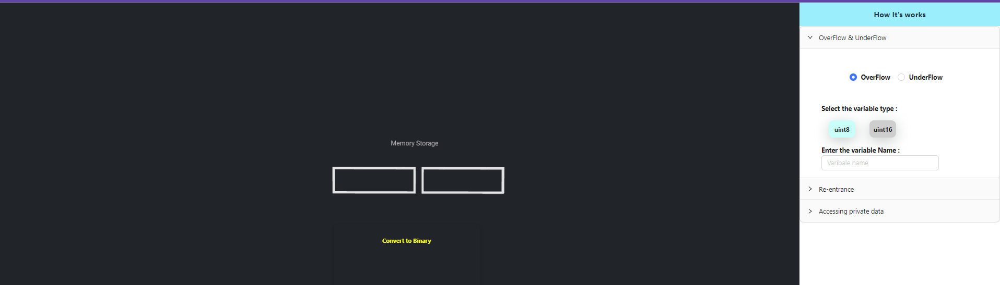

Enter the value for unit8

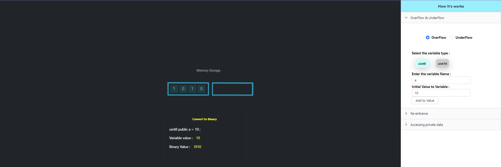

Enter a value greater than 255 

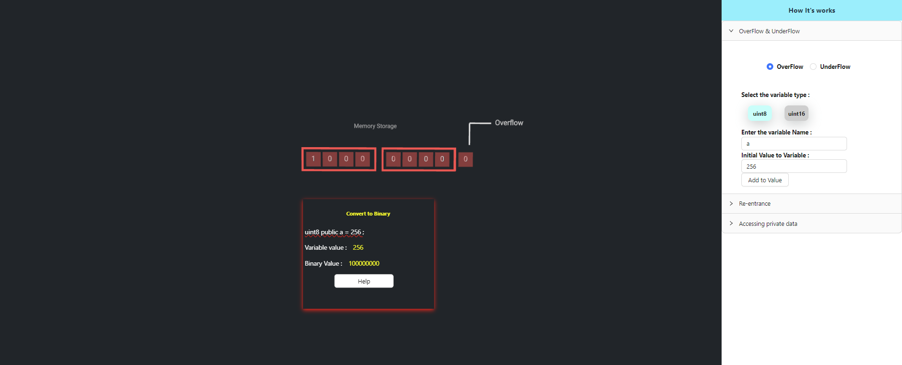

Click on help button to see the explanation 

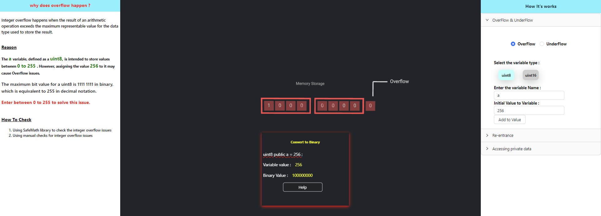

Clcik on underflow button 

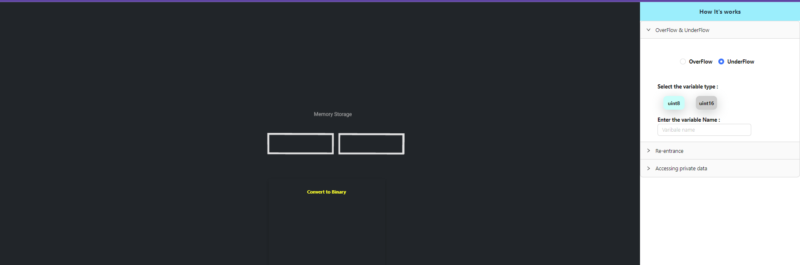

Enter value for unit8

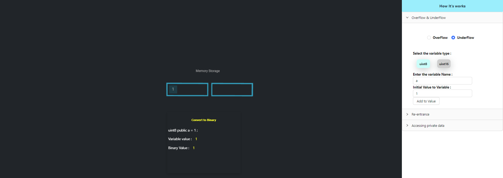

Enter a value less than 0 

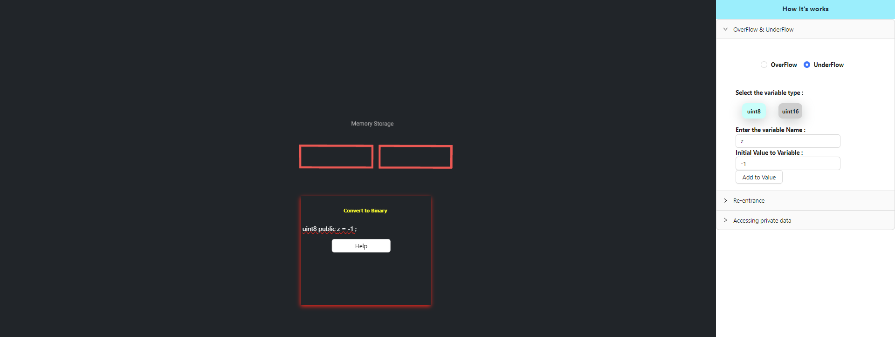

Click on help button to see the explanation 

<h5>Re-entrance</h5>

Click on attack button and observe the changes happening carefully 

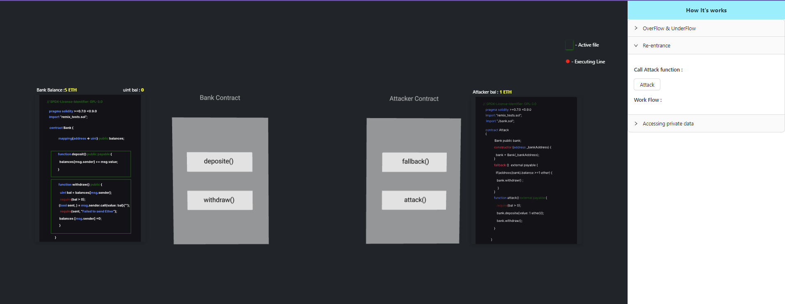

step 1 

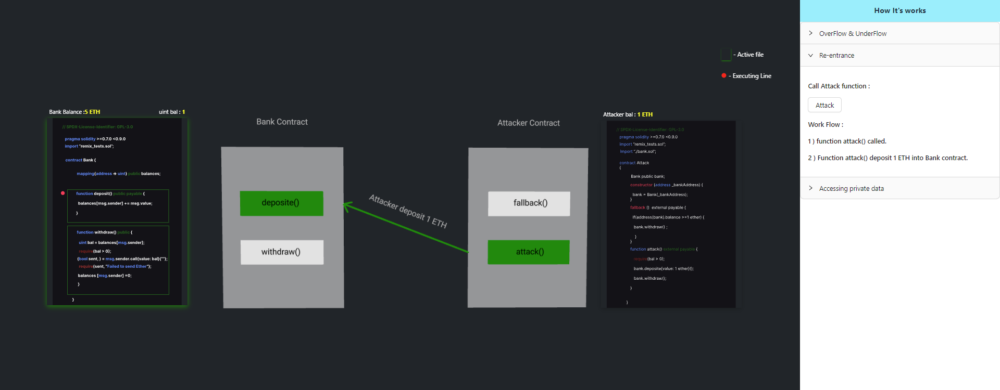

step 2 

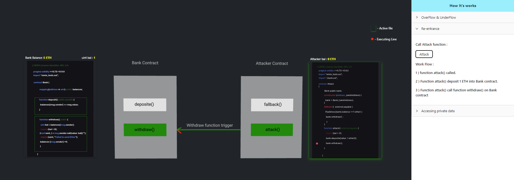

step 3 

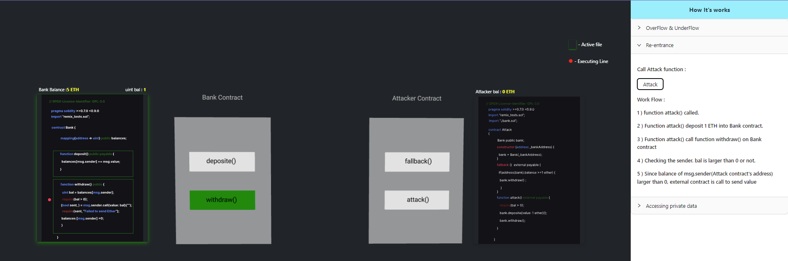

step 4 

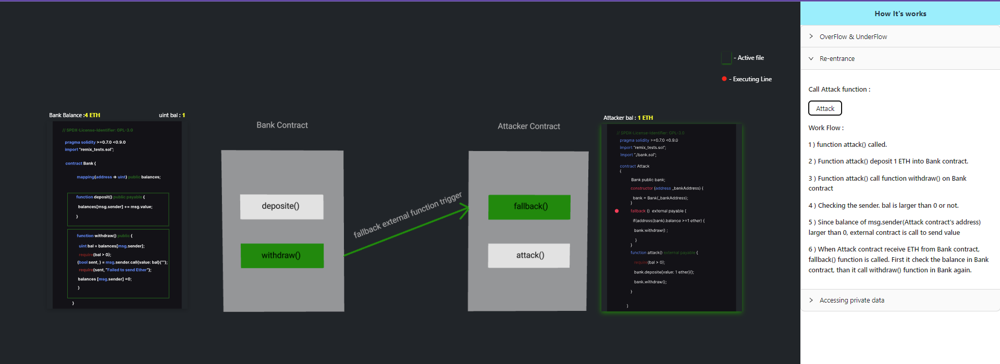

step 5 

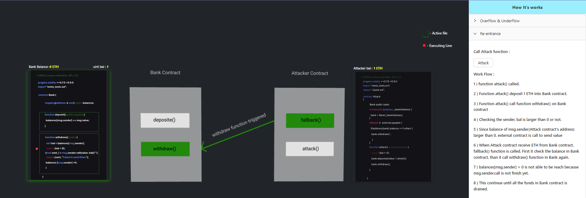

step 6 

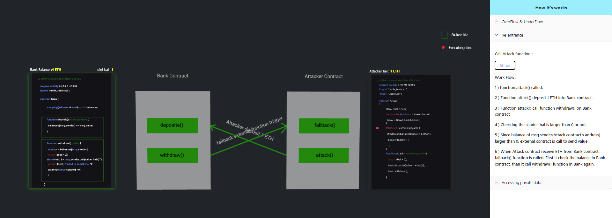
