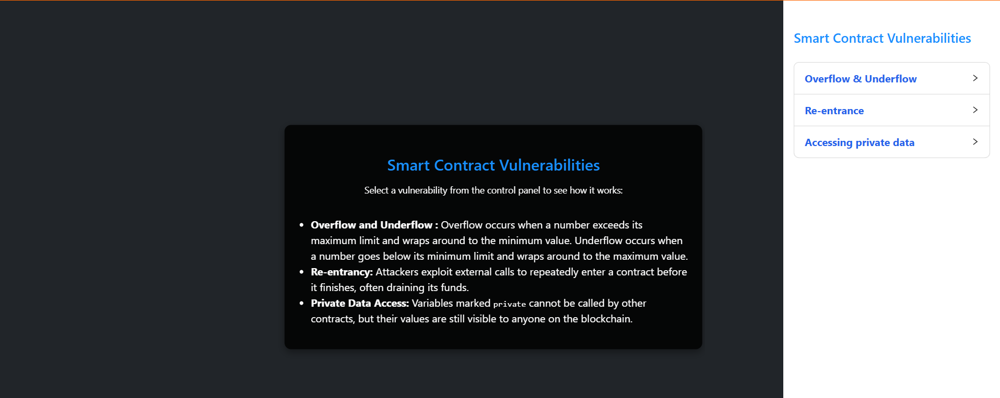
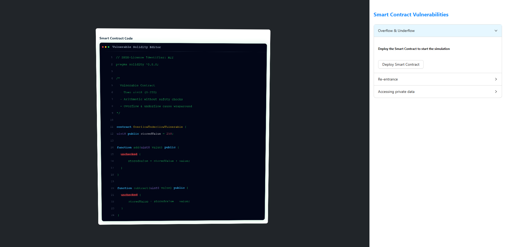
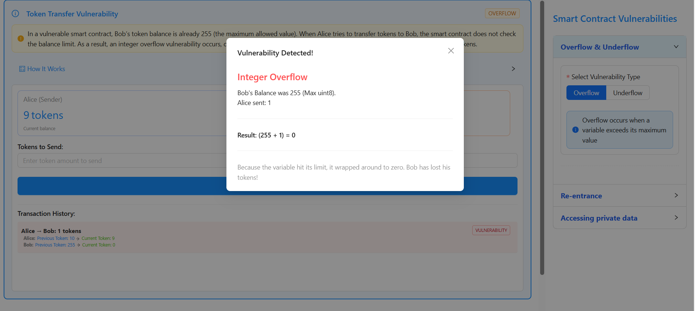
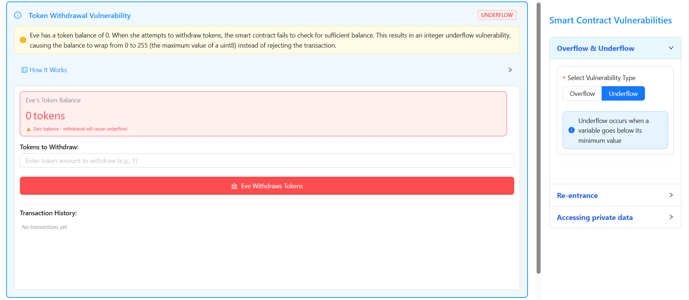
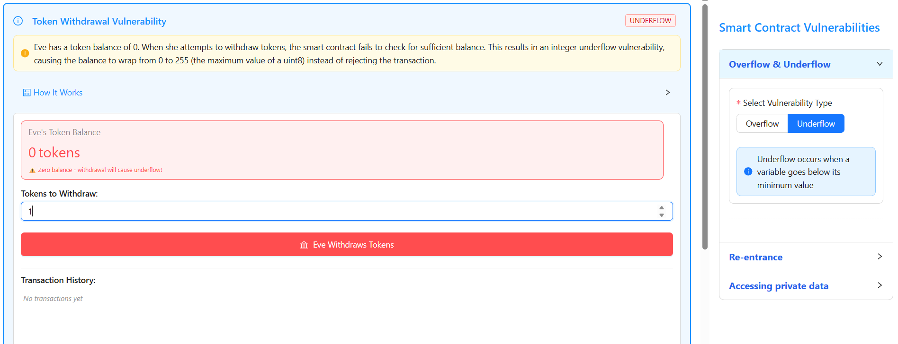
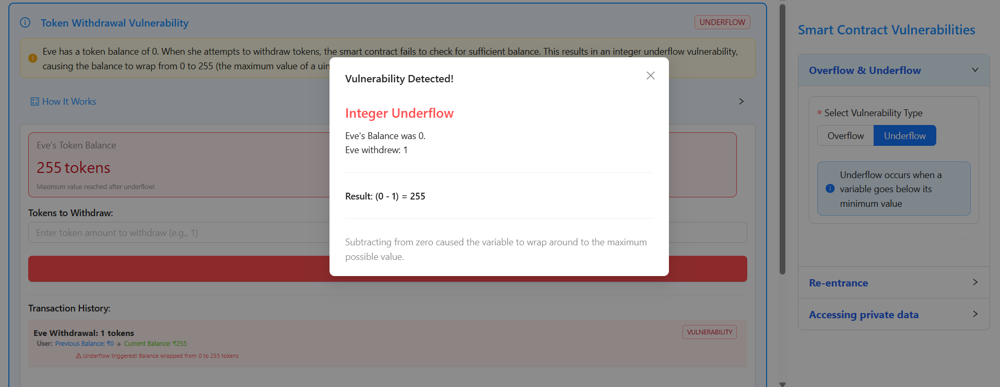
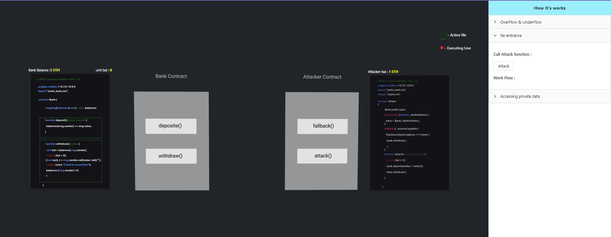
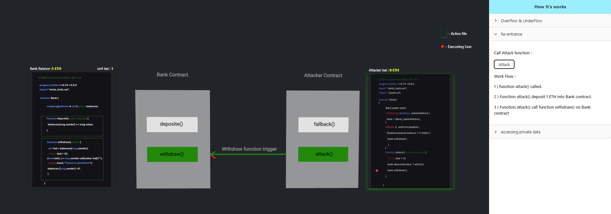
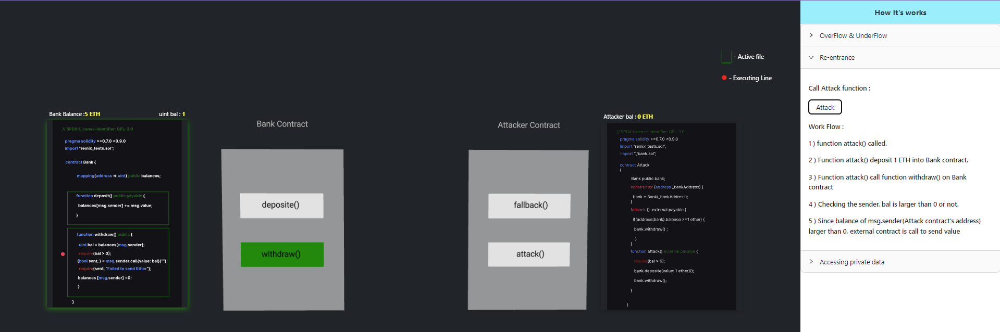
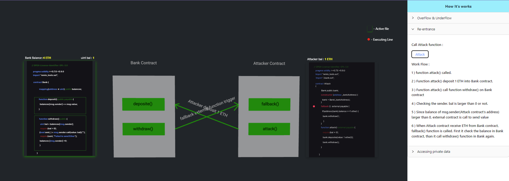

<!-- ### Procedure -->

<h5>Overflow & Underflow</h5>
 

  1. Open the Smart Contract Vulnerabilities page and choose either <b>Overflow</b> or <b>Underflow</b> from the right-side control panel by clicking on <b>Overflow &amp; Underflow</b>.

  

 

  2. Under <b>Select Vulnerability Type</b>, click <b>Overflow</b> and observe the initial balances where <b>Alice (Sender)</b> has 10 tokens and <b>Bob (Recipient)</b> has 255 tokens (maximum value of uint8).

 

  3. In the <b>Tokens to Send</b> input field, enter <b>1</b>, click on <b>“Alice Sends Tokens to Bob”</b>, observe a popup showing <b>“Vulnerability Detected – Integer Overflow”</b>, and note that the calculation <b>(255 + 1 = 0)</b> causes Bob’s balance to wrap from <b>255 to 0 tokens</b>, which is confirmed in the <b>Transaction History</b> where the overflow vulnerability is highlighted.

 

  4. From the right-side control panel under <b>Overflow &amp; Underflow</b>, click <b>Underflow</b> and observe that <b>Eve</b> has an initial balance of <b>0 tokens</b>.

 5. In the <b>Tokens to Withdraw</b> input field, enter <b>1</b> and click on <b>“Eve Withdraws Tokens”</b>.

 

  6. Observe a popup displaying <b>“Vulnerability Detected – Integer Underflow”</b>, where the calculation <b>(0 − 1 = 255)</b> causes Eve’s balance to wrap from <b>0 to 255 tokens</b>, which is confirmed in the <b>Transaction History</b> indicating the underflow vulnerability.

 
<h5>Re-entrancy</h5>

Click on the attack button and observe the changes happening carefully.

Step 1: The attack() function deposits 1 ETH into the Bank contract.

Step 2: The attack() function deposits 1 ETH into the Bank contract.

Step 3: Since the balance of msg.sender (the Attack contract's address) is greater than 0, an external contract is called to send the value.

Step 4: When the Attack contract receives ETH from the Bank contract, the fallback() function is called. First, it checks the balance in the Bank contract, then it calls the withdraw() function in the Bank contract again.

Step 5: The line balances[msg.sender] = 0 is not reached because msg.sender.call has not finished yet. This continues until all the funds in the Bank contract are drained.

<!-- 
Step 6

 -->
