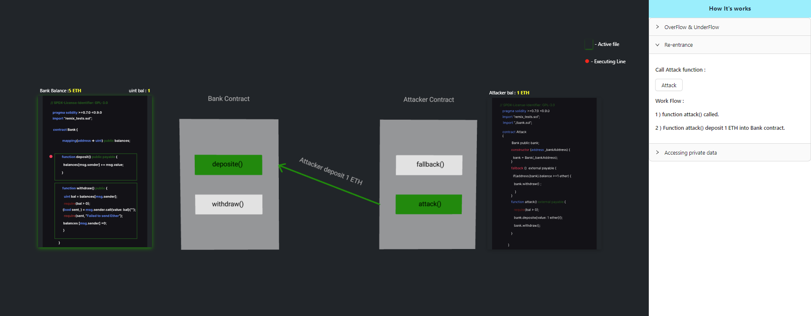
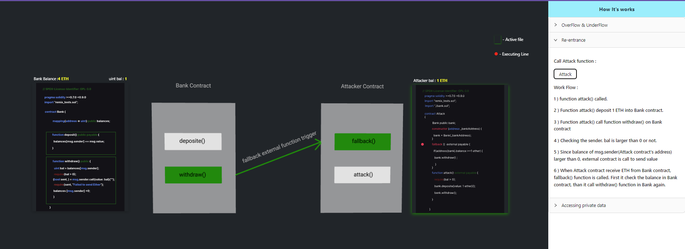
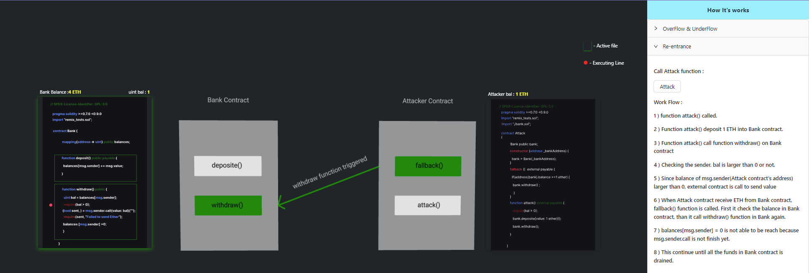
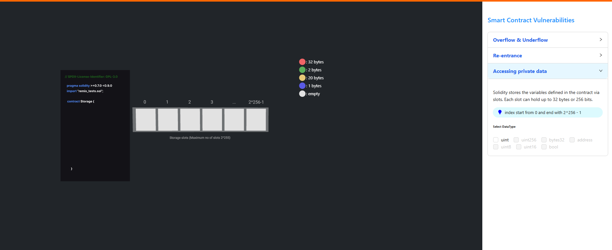
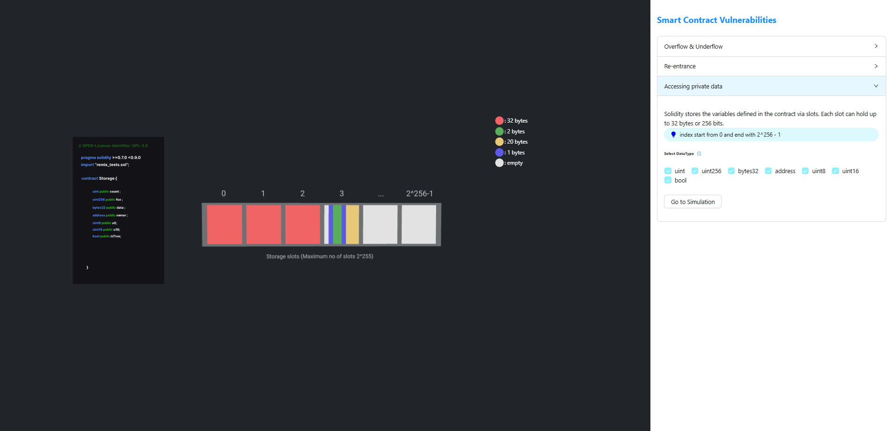
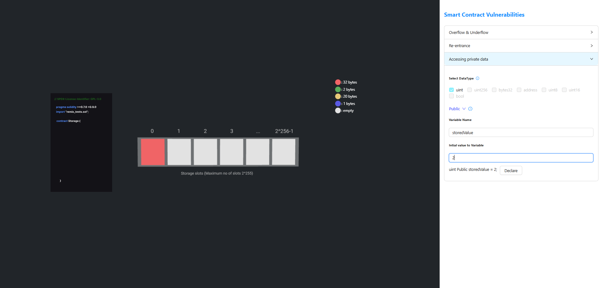
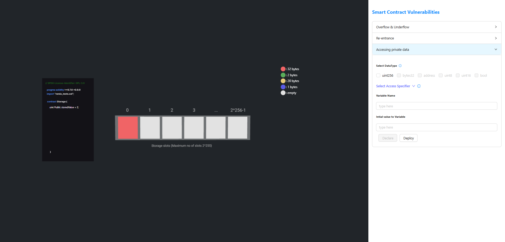
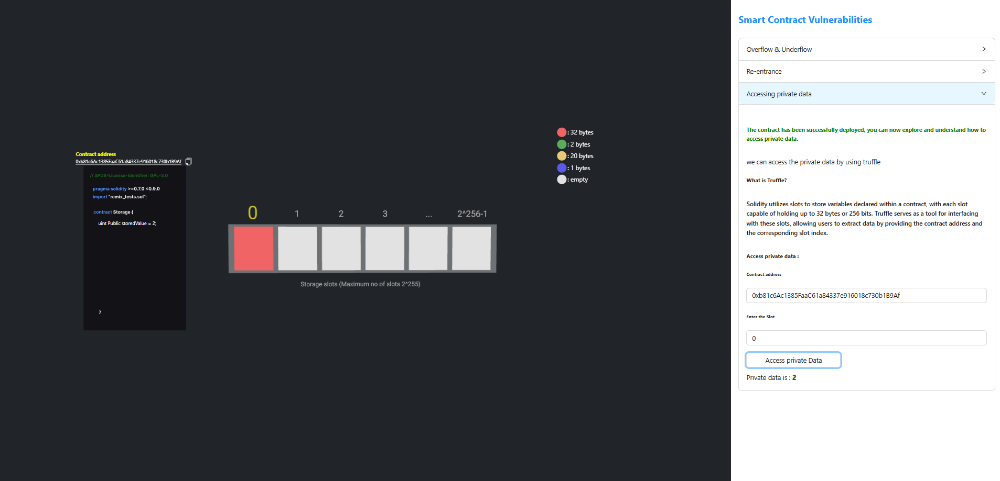

<!-- ### Procedure -->

<h5>Overflow & Underflow</h5>
 

  1. Open the Smart Contract Vulnerabilities page and choose either <b>Overflow</b> or <b>Underflow</b> from the right-side control panel by clicking on <b>Overflow &amp; Underflow</b>.

  

 

  2. Under <b>Select Vulnerability Type</b>, click <b>Overflow</b> and observe the initial balances where <b>Alice (Sender)</b> has 10 tokens and <b>Bob (Recipient)</b> has 255 tokens (maximum value of uint8).

 

  3. In the <b>Tokens to Send</b> input field, enter <b>1</b>, click on <b>“Alice Sends Tokens to Bob”</b>, observe a popup showing <b>“Vulnerability Detected – Integer Overflow”</b>, and note that the calculation <b>(255 + 1 = 0)</b> causes Bob’s balance to wrap from <b>255 to 0 tokens</b>, which is confirmed in the <b>Transaction History</b> where the overflow vulnerability is highlighted.

 

  4. From the right-side control panel under <b>Overflow &amp; Underflow</b>, click <b>Underflow</b> and observe that <b>Eve</b> has an initial balance of <b>0 tokens</b>.

 5. In the <b>Tokens to Withdraw</b> input field, enter <b>1</b> and click on <b>“Eve Withdraws Tokens”</b>.

 

  6. Observe a popup displaying <b>“Vulnerability Detected – Integer Underflow”</b>, where the calculation <b>(0 − 1 = 255)</b> causes Eve’s balance to wrap from <b>0 to 255 tokens</b>, which is confirmed in the <b>Transaction History</b> indicating the underflow vulnerability.

 

#### Re-entrancy

Click the **Attack** button to initiate the re-entrancy attack and observe the contract behavior step by step.

#### Step 1: Deposit Ether

The `attack()` function is executed, which deposits **1 ETH** into the vulnerable Bank contract.

#### Step 2: Initiate Withdrawal

After the deposit, the `attack()` function invokes the `withdraw()` function of the Bank contract.

#### Step 3: External Call Execution

Since the balance of `msg.sender` (the Attack contract address) is greater than zero, the Bank contract performs an **external call** to transfer ETH.

#### Step 4: Re-entrant Callback

When ETH is received, the Attack contract’s `fallback()` function is triggered.  
Before the Bank contract updates the sender’s balance, the fallback function calls `withdraw()` again.

#### Step 5: Drain Contract Balance

Because `balances[msg.sender] = 0` is executed only after the external call completes, the withdrawal process is re-entered repeatedly.  
This continues until the Bank contract’s balance is fully drained.

#### Accessing Private Data

#### Step 1: Select the Vulnerability

From the **Smart Contract Vulnerabilities** panel on the right side, select **Accessing private data**.  
This opens the simulation explaining how Solidity stores state variables using storage slots.

#### Step 2: Select Data Types

- Select the required **data type(s)** from the **Select DataType** section.
- Click **Go to Simulation** to proceed.

#### Step 3: Declare a State Variable

- Select the **Access Specifier** (e.g., `public` or `private`).
- Enter the **Variable Name**.
- Enter the **Initial Value**.
- Click **Declare** to add the variable to the contract.

#### Step 4: Deploy the Contract

- Click **Deploy** to deploy the smart contract.
- After successful deployment, the **Contract Address** is displayed.

#### Step 5: Access the Private Data

- Copy the **Contract Address**.
- Paste it into the **Contract address** field under _Access private data_.
- Enter the corresponding **Storage Slot Number**.
- Click **Access private Data**.

The value stored in the specified storage slot is displayed, even if the variable is declared as `private`.
