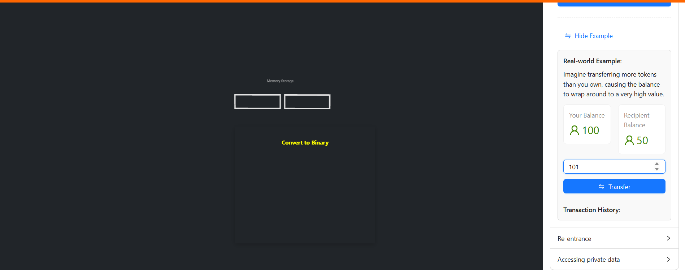

### Procedure

<h5>Overflow & Underflow</h5>

1. Choose <b>Overflow</b> or <b>Underflow</b> from the given options.

2. Select the data type as <b>uint8</b>.

3. Enter a value greater than 255.

4. Click the <b>Help</b> button to see the explanation.

5. Click the <b>Underflow</b> button and select a data type.

6. Enter a value less than 0.

7. Click the <b>Help</b> button to see the explanation.

8. Click the <b>Show Example</b> button to view an example of overflow.

9. Enter an amount greater than the sender’s balance.

10. Click the <b>Transfer</b> button to see an overflow alert message.

11. Enter a negative amount.

12. Click the <b>Transfer</b> button.

<h5>Re-entrancy</h5>

Click on the attack button and observe the changes happening carefully.

Step 1: The attack() function deposits 1 ETH into the Bank contract.

Step 2: The attack() function deposits 1 ETH into the Bank contract.

Step 3: Since the balance of msg.sender (the Attack contract's address) is greater than 0, an external contract is called to send the value.

Step 4: When the Attack contract receives ETH from the Bank contract, the fallback() function is called. First, it checks the balance in the Bank contract, then it calls the withdraw() function in the Bank contract again.

Step 5: The line balances[msg.sender] = 0 is not reached because msg.sender.call has not finished yet. This continues until all the funds in the Bank contract are drained.

<!-- 
Step 6

 -->
