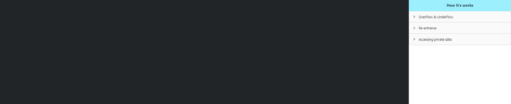

<u><b>Procedure</b></u>

 Choose one of the following options 

 If the choosen option is overflow and undeflow then follow the below steps 

Enter the value for unit8

Enter a value greater than 255 

Click on help button to see the explanation 

Clcik on underflow button 

Enter value for unit8

Enter a value less than 0 

Click on help button to see the explanation 

<h5>Re-entrance</h5>

Click on attack button and observe the changes happening carefully 

step 1 

step 2 

step 3 

step 4 

step 5 

step 6 

