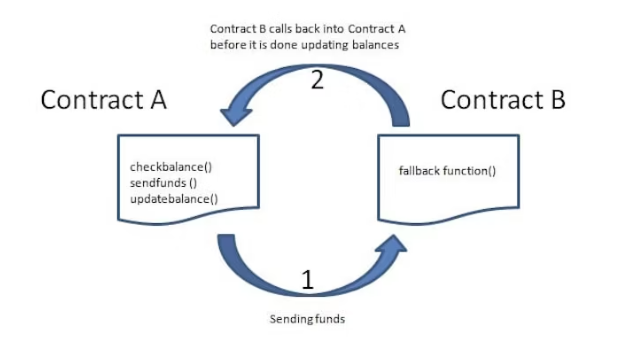

<!-- ### Theory -->

<h4>Overflow and Underflow Attacks on Smart Contracts</h4> 
Smart contracts often use integer variables to store balances, counters, or other numeric values. However, integers in Solidity have finite sizes, meaning they can only represent values within a specific range:
 <ul> <li><b>uint8:</b> Unsigned integers from 0 to 255</li> <li><b>uint16:</b> Unsigned integers from 0 to 65,535</li> </ul> 
<b>Overflow:</b> An overflow occurs when a calculation exceeds the maximum value the data type can store. For example, adding 1 to a uint8 with value 255 wraps it back to 0. This happens due to arithmetic wrapping caused by the finite range of the integer type.
 
<b>Underflow:</b> Conversely, an underflow occurs when a calculation goes below the minimum value (0), wrapping around to the maximum value of the data type.
 
<b>Impact:</b> Overflow and underflow vulnerabilities can allow attackers to manipulate balances, bypass limits, or mint unlimited tokens. While modern Solidity versions have built-in overflow/underflow protection, understanding this vulnerability is crucial for analyzing legacy contracts.
 
<b>Hands-on Hint:</b> In this experiment, you will attempt to overflow a <b>uint8</b> balance to observe how arithmetic wrapping affects contract behavior.

<h4>Re-entrancy</h4>

The re-entrancy attack is one of the most destructive attacks in Solidity smart contracts. A re-entrancy attack occurs when a function makes an external call to another untrusted contract, and then the untrusted contract makes a recursive call back to the original function in an attempt to drain funds.

A re-entrancy attack involves two smart contracts: a vulnerable contract and an untrusted attacker’s contract.

<h4>Accessing Private Data</h4> 
In Solidity, declaring a variable <code>private</code> only prevents other contracts from accessing it directly; it does <strong>not</strong> hide the value from the public. Blockchains are transparent — anyone can read contract storage using blockchain explorers or by inspecting on-chain storage.
 
<strong>Example:</strong>
 <pre><code>pragma solidity ^0.6.0;

contract PrivateData {
string private password = "mySecret123"; // still visible on the blockchain
}
</code></pre>

<strong>Exploit Impact:</strong>
 <ul> <li>If sensitive information (passwords, private keys, API tokens, secret salts) is stored on-chain, attackers can retrieve it directly even when declared <code>private</code>.</li> <li>Leaked secrets can lead to credential theft, unauthorized access, token minting, or other downstream compromises.</li> </ul> 
<strong>Best practices:</strong>
 <ul> <li>Never store secrets on-chain. Keep sensitive values off-chain (secure servers, secret managers).</li> <li>If you must reference secret material, store only hashes or use commit–reveal schemes so the secret itself is not publicly exposed.</li> <li>Use secure oracles or middleware to handle confidential data and perform sensitive operations off-chain.</li> </ul>
